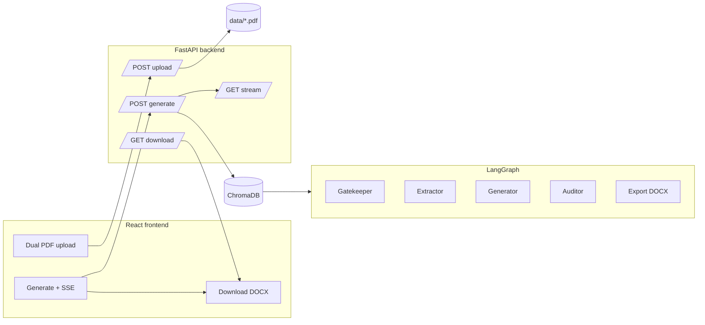

# TenderForge PK

**Enterprise tender desk for Pakistan public procurement** — pair a government solicitation with your company profile, run a **dual-context RAG** pipeline with **document authenticity screening**, and download a **formatted Word technical proposal** generated entirely through **your own backend** (no third-party SaaS for document processing).

---

## Why TenderForge PK

| Capability | What it does |
|------------|----------------|
| **Dual-source RAG** | Separate Chroma collections: **tender** (rules / scope) and **company_vault** (PEC, experience, credentials). The generator maps requirements to *your* evidence instead of bracket placeholders. |
| **Gatekeeper** | Before the heavy LangGraph loop, an LLM validates that uploads look like real procurement + company material — rejects homework, fiction, or irrelevant PDFs with a clear reason. |
| **Compliance loop** | Extractor → generator → auditor → export, with revisions until pass or max revisions, then export with corporate Word styling (cover page, headings, bullets, inline bold). |
| **Privacy** | PDFs stay under your API; embeddings live in **local ChromaDB** on disk. Configure **Groq** via `.env` only on the machine running the API. |

---

## Architecture (high level)



1. **Upload** saves `backend/data/tender.pdf` and `backend/data/company_profile.pdf`, wipes **`backend/chroma_db`** so vectors never bleed between runs.  
2. **Generate** runs **`run_ingestion()`** (fresh index: tender collection + company vault), optional **sync gatekeeper** rejection response, then streams LangGraph steps over **SSE**.  
3. **Download** returns the run’s `Final_Proposal.docx`.

---

## Tech stack

| Layer | Choices |
|-------|---------|
| **Frontend** | React 19, Vite 8, Tailwind CSS v4, Framer Motion, Lucide, Axios |
| **Backend** | Python 3.11+, FastAPI, Uvicorn |
| **Orchestration** | LangGraph |
| **LLM** | Groq (`ChatGroq`, `llama-3.3-70b-versatile`) |
| **Embeddings / vector store** | Hugging Face `sentence-transformers/all-MiniLM-L6-v2`, ChromaDB |
| **Documents** | PyMuPDF (PDF), **python-docx** (proposal export) |

---

## Prerequisites

- **Node.js** 18+ and **npm**
- **Python** 3.11+ with **pip**
- A **[Groq](https://console.groq.com/) API key** for chat completion

---

## Quick start

### 1. Clone and configure secrets

```bash
git clone https://github.com/muhaddasgujjar/tenderforge-pk.git
cd tenderforge-pk
```

If you have not renamed the GitHub repository yet, use your current repo URL (for example `langchain_project`) until you complete the rename below.

Copy the backend env template and add your key:

```bash
cp backend/.env.example backend/.env
# Edit backend/.env — set GROQ_API_KEY=...
```

Never commit `backend/.env` (it is gitignored).

### 2. Backend

```bash
cd backend
pip install -r requirements.txt
uvicorn main:app --reload --host 127.0.0.1 --port 8000
```

Health check: [http://127.0.0.1:8000/api/health](http://127.0.0.1:8000/api/health)

### 3. Frontend

```bash
cd frontend
npm install
npm run dev -- --host 127.0.0.1
```

Open [http://127.0.0.1:5173](http://127.0.0.1:5173) — the UI expects the API at **port 8000** (see `frontend/src/services/api.js`).

### 4. Smoke test (optional)

With the API running and sample PDFs under `backend/data/`:

```bash
cd backend
python smoke_api.py --quick      # health only
python smoke_api.py              # full flow if .env + PDFs exist
```

---

## Main HTTP API

| Method | Path | Purpose |
|--------|------|---------|
| `GET` | `/api/health` | Liveness |
| `POST` | `/api/upload` | Multipart: **`tender_file`**, **`profile_file`** (PDFs) → saves under `backend/data/`, clears Chroma |
| `POST` | `/api/generate` | Body: `{ "run_id", "filename" }` → ingests, gatekeeper may return `{ "status": "rejected", "reason" }` or starts LangGraph |
| `GET` | `/api/stream?run_id=` | Server-Sent Events for graph progress |
| `GET` | `/api/download?run_id=` | Generated `.docx` |
| `GET` | `/api/runs/{run_id}` | Run summary (status, audit, rejection, etc.) |
| `GET` | `/api/chat/status` | `{ "indexed": true }` if Chroma has been built (after **Generate**) |
| `POST` | `/api/chat` | Body: `{ "message": "…" }` — **RAG** over tender + company Chroma → `{ "answer": "…" }` |

Legacy endpoints (`/api/ingest`, `/api/run`) remain for older flows. The chat uses the same dual collections as the main pipeline; run **Upload** + **Generate** first so retrieval has content.

---

## Repository layout

```
tenderforge-pk/
├── backend/
│   ├── main.py              # FastAPI app, upload / generate / SSE / download
│   ├── core/
│   │   ├── graph.py         # LangGraph: gatekeeper, extractor, generator, auditor, export
│   │   └── ingest.py        # Chroma ingest, run_ingestion()
│   ├── data/                # tender.pdf, company_profile.pdf (from upload; not committed)
│   ├── chroma_db/           # local vector store (gitignored)
│   ├── output/              # generated DOCX per run (gitignored)
│   └── smoke_api.py
├── frontend/
│   └── src/                 # React app (upload, generation status, results)
└── README.md
```

---

## Renaming this repository on GitHub

This project is intended to live under the name **`tenderforge-pk`**.

1. On GitHub open the repo → **Settings → General → Repository name** → change to **`tenderforge-pk`** → **Rename**. (GitHub will redirect the old URL for a while.)
2. Point your local `origin` at the new URL and push:

   ```bash
   git remote set-url origin https://github.com/muhaddasgujjar/tenderforge-pk.git
   git remote -v
   git push -u origin main
   ```

Replace `muhaddasgujjar` with your GitHub username if different.

If you prefer a **new empty repo** named `tenderforge-pk` instead of renaming, create it on GitHub, then use the same `git remote set-url` and push.

---

## Security reminders

- **Rotate any API key** that was ever committed or pushed in `.env`.
- Keep **`backend/.env`** out of version control; use **`backend/.env.example`** as the only tracked template.

---

## License

Add a `LICENSE` file for your organization (proprietary, MIT, etc.).

---

**TenderForge PK** — structured bids, private infrastructure.
